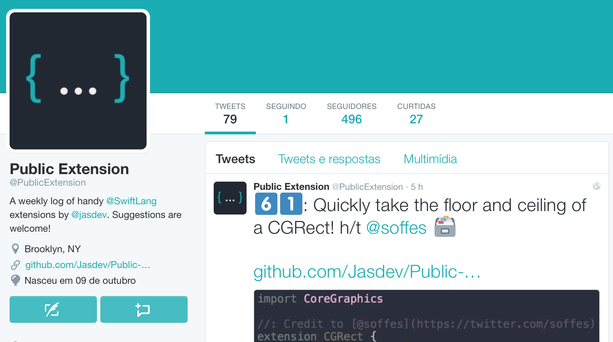
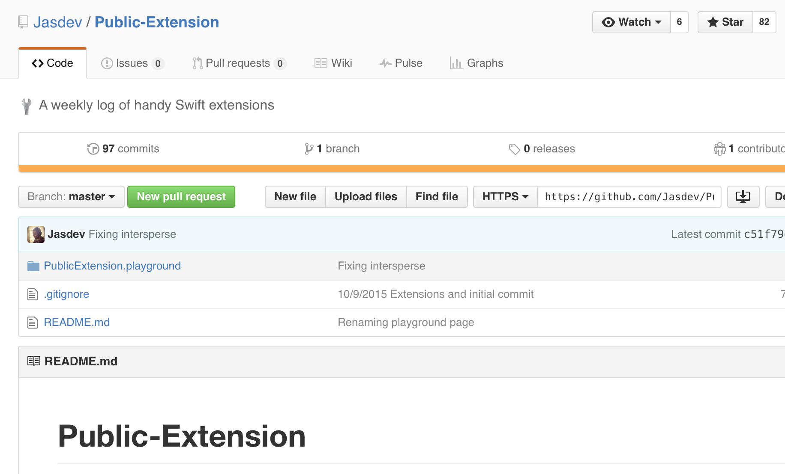

footer: Swift code snippets - v1
slidenumbers: true

# Swift
### Code snippets

---

# Principles

* Modern syntax
* Beautiful and natural code
* Readable and maintainable
* Expressiveness

---

# Topics

* Enums (Storyboard ids, urls, colors, images)
* Extensions (views, strings)
* Clousures
* Type alias

---

# Enumerations

### Simple to define, simple to use

---

> Defines a common type for a group of related values in a type-safe way
-- The Swift Programming Language

---
# Basic enumeration
```Swift
enum SomeEnumeration {
    // enumeration definition goes here
}

```
---
# Basic enumeration
```swift
enum Direction {
    case Right
    case Left
}
```
### Single line declaration
```swift
enum Direction {
    case Right, Left
}
```
---
### Use
```swift
var direction = Direction.Left

direction = .Right

if direction == .Right {
  // code
}
```
---
# Using other types

```swift
enum Scenes: String {
  case Main = "MainView"
  case Detail = "DetailView"
}

let scene = Scenes.Detail.rawValue

let viewController =
      self.storyboard?.instantiateViewControllerWithIdentifier(scene)
```
---

```swift
enum Scenes: String {
  case Main = "MainView"
  case Detail = "DetailView"

  var value: String {
    get {
      return self.rawValue
    }
  }
}

let scene = Scenes.Detail.value

```
---

```swift
enum Scenes: String {
  case Main = "MainView"
  case Detail = "DetailView"

  func value() -> String {
    return self.rawValue
  }
}

let scene = Scenes.Detail.value()

```
---
# Using other types
---
```swift
enum Theme {
    case Auto, Life
}

```
---
```swift
enum Theme {
    case Auto, Life

    func color() -> UIColor {

    }
}

```
---
```swift
enum Theme {
    case Auto, Life

    func color() -> UIColor {
        switch self {
        case .Auto:
            return UIColor.blueColor()
        case .Life:
            return UIColor.whiteColor()
        }
    }
}

```
---
```swift
self.backgroundColor = Theme.Auto.color()
```
---
#Enum inner Enum
---
```swift
enum Paths {

    enum Auth: String {
        case Login = "/users/login"
        case Logout = "/users/logout"
    }

    enum Accounts: String {
        case Create = "/accounts/create"
        case Update = "/accounts/update"
    }

}
```
---
```swift
let path = Paths.Users.Login.value

let url = NSURL(string: path)

```
---
# Help with assets
---
```swift
enum Assets: String {

    case User = "user-icon"
    case Phone = "phone-icon"

}
```
---
```swift
enum Assets: String {

    case User = "user-icon"
    case Phone = "phone-icon"

    func image() -> UIImage {
        return UIImage(named: self.rawValue)!
    }

}

```
---
```swift
enum Assets: String {

    case User = "user-icon"
    case Phone = "phone-icon"

    func image() -> UIImage {
        return UIImage(named: self.rawValue)!
    }

}

imageView.image = Assets.Phone.image()
```
---

#[fit]imageView.image = Assets.Phone.image()

---

# Extensions
### Where the magic happens

---

> Extensions add new functionality to an existing class, structure, enumeration, or protocol type
-- The Swift Programming Language

---

# The problem

```swift
var text = " Apple "
// " Apple "

let charset =
NSCharacterSet.whitespaceAndNewlineCharacterSet()
text.stringByTrimmingCharactersInSet(charset)
// "Apple"
```

---

#text.trim()

---

# Basic syntax

```swift
extension SomeType {
    // new functionality to add to SomeType goes here
}
```

---

# String extension

```swift

extension String {

    func trim() -> String {

    }

}
```

---

# String extension

```swift
extension String {

    func trim() -> String {
      let charset =
      NSCharacterSet.whitespaceAndNewlineCharacterSet()
      return self.stringByTrimmingCharactersInSet(charset)
    }

}
```

---

#text.trim()
# "Apple"

---

# Background problem

```swift

let window = UIApplication.sharedApplication().keyWindow!
window.backgroundColor = UIColor.yellowColor()

```

---

# UIApplication extension

```swift
extension UIApplication {

    var backgroundColor: UIColor?

    // ❌Extensions may not contain stored properties

}
```

---

# UIApplication extension

```swift
extension UIApplication {

    var backgroundColor: UIColor? {
        set {

        }
        get {

        }
    }

}
```

---
# UIApplication extension

```swift
extension UIApplication {

    class var backgroundColor: UIColor? {
        set {
            let window = UIApplication.sharedApplication().keyWindow!
            window.backgroundColor = newValue
        }
        get {
            let window = UIApplication.sharedApplication().keyWindow!
            return window.backgroundColor
        }
    }

}
```

---

# [fit] UIApplication.backgroundColor = UIColor.yellowColor()

---

# Protocol extensions

---
# Protocol extensions
```swift
extension SomeType: SomeProtocol, AnotherProtocol {
    // implementation of protocol requirements goes here
}
```
---
# Allows you organize your

```swift
class SomeViewController: UIViewController {    
    // code goes here
}
```
---
# Allows you organize your

```swift
class SomeViewController: UIViewController, UITableViewDataSource {    
    // code goes here
}
```
---
# Allows you organize your

```swift
class SomeViewController: UIViewController, UITableViewDataSource {    

  func tableView(tableView: UITableView, numberOfRowsInSection section: Int) -> Int {
      return 1
  }

  func tableView(tableView: UITableView, numberOfRowsInSection section: Int) -> Int {
     return items.count
  }

  func tableView(tableView: UITableView, cellForRowAtIndexPath indexPath: NSIndexPath) -> UITableViewCell {
      return tableView.dequeueReusableCellWithIdentifier("id")!
  }

}
```

---

# Allows you organize your

```swift
class SomeViewController: UIViewController {    
    // code goes here
}

extension SomeViewController: UITableViewDataSource {

    func tableView(tableView: UITableView, numberOfRowsInSection section: Int) -> Int {
        return 1
    }

    func tableView(tableView: UITableView, numberOfRowsInSection section: Int) -> Int {
       return items.count
    }

    func tableView(tableView: UITableView, cellForRowAtIndexPath indexPath: NSIndexPath) -> UITableViewCell {
        return tableView.dequeueReusableCellWithIdentifier("id")!
    }

}
```
---

#@PublicExtension



---

#github.com/Jasdev/Public-Extension



---

# Clousures

### a.k.a. blocks

---

> Closures are self-contained blocks of functionality that can be passed around and used in your code
-- The Swift Programming Language

---

# Clousures syntax

```Swift
{ (parameters) -> (return type) in
    // code
}
```

## Signature

```Swift
(parameters) -> (return type)
```
---

# Clousure in a method signature

```swift
func POST(URLString: String!,
          success: ((task: NSURLSessionDataTask!, object: AnyObject!) -> Void)!,
          failure: ((task: NSURLSessionDataTask!, error: NSError!) -> Void)!) {

}
```
---

# Clousure in a method signature

```swift
func POST(URLString: String!,
          success: ((task: NSURLSessionDataTask!, object: AnyObject!) -> Void)!,
          failure: ((task: NSURLSessionDataTask!, error: NSError!) -> Void)!) {

}

(task: NSURLSessionDataTask!, object: AnyObject!) -> Void
```
---

# Clousure in a method signature

```swift
func POST(URLString: String!,
          success: ((task: NSURLSessionDataTask!, object: AnyObject!) -> Void)!,
          failure: ((task: NSURLSessionDataTask!, error: NSError!) -> Void)!) {

}

(task: NSURLSessionDataTask!, object: AnyObject!) -> Void

(parameters) -> (return type)
```
---

#(in) -> (out)
---

#( ) -> ( )

---

# Type Aliases
### Type aliases define an alternative name for an existing type

---

# Type Aliases syntax

```swift
typealias AudioSample = UInt16
```

---

# Type Aliases syntax

```swift
typealias AudioSample = UInt16

typealias Success =

```
---

# Type Aliases syntax

```swift
typealias AudioSample = UInt16

typealias Success = (parameters) -> (return type)

```

---

# Type Aliases syntax

```swift
typealias AudioSample = UInt16

typealias Success = (task: NSURLSessionDataTask!, object: AnyObject!) -> Void

```
---

# Type Aliases syntax

```swift
typealias AudioSample = UInt16

typealias Success = (task: NSURLSessionDataTask!, object: AnyObject!) -> Void
typealias Failure = (task: NSURLSessionDataTask!, error: NSError!) -> Void

```
---

# Type Aliases syntax

```swift
typealias AudioSample = UInt16

typealias Success = (task: NSURLSessionDataTask!, object: AnyObject!) -> Void
typealias Failure = (task: NSURLSessionDataTask!, error: NSError!) -> Void

func POST(URLString: String!,
          success: Success!,
          failure: Failure!) {

}

```
---

# Type Aliases syntax

```swift

func POST(URLString: String!,
          success: Success!,
          failure: Failure!) {

}

```
---

# Just to remember

```swift

func POST(URLString: String!,
          success: ((task: NSURLSessionDataTask!, object: AnyObject!) -> Void)!,
          failure: ((task: NSURLSessionDataTask!, error: NSError!) -> Void)!) {

}


func POST(URLString: String!,
          success: Success!,
          failure: Failure!) {

}

```
---

# Q & A

---
# Thank you!

### @madsonmac
### madsonmac@gmail.com
